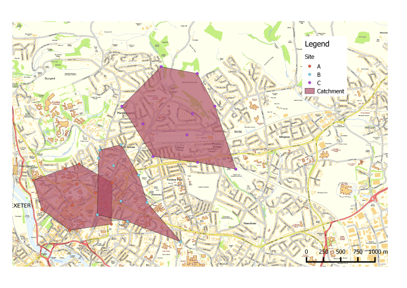
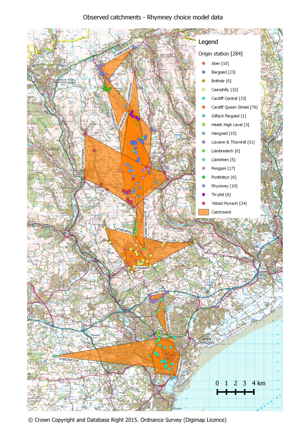

# Using R, PostgreSQL, PostGIS and pgRouting to automatically generate multiple site or facility catchment area polygons  

This R script can be used in conjunction with a PostgreSQL spatially-enabled database to generate multiple catchment area polygons. It uses the pgRouting pgr_pointsAsPolygon function, which draws an alpha shape around a given set of points. This is useful for visualising the catchment areas around multiple sites or facilities. This script is a simplified version of one that I used to visualise railway station catchments. I had results from a passenger survey, and for each passenger I knew their origin postcode and the railway station that they chose to depart from. I therefore wanted to visualise the observed station catchments as revealed by the survey, and due to the dataset size needed this to be an automated process.

## Assumptions

The script assumes the following:

* You have a spatially enabled PostgreSQL database called 'spatial' which has the postgis and pgrouting extensions installed
* You have the survey data in a database table called 'survey', structured as follows:
  * A row for each individual
  * A column called 'site' which contains the name of the chosen site (e.g. station name in my case)
  * A geometry column (point) called 'geom' which represent the location of the site/facility users.
  
I used postcode centroid as the origin location, and held the geometry data in a separate codepoint table, pulling it in using a join. This also enabled me to select just the unique origin postcodes to be used to form the polygons. You can of course amend the script to fit existing database and table structures.
  
The file [survey.zip](survey.zip) is an example shapefile which contains made-up data in the correct format which can be imported into PostgreSQL for testing. 

## The script
The file [create_catchment_polygons.R](create_catchment_polygons.R) contains all the code needed to generate catchment polygons for the example data. The included comments should be self-explanatory. In brief, the script does the following:

* Creates a table in the database to store the generated catchment polygons (catchment_polygons)
* Queries the 'survey' table to get a list of unique sites which are placed in a dataframe
* Loops through the dataframe, and for each unique site:
  * creates a temporary database table to hold the 'id' and 'geom' for those rows from 'survey' that relate to the site 
  * checks that the temp table has at least 3 rows (pgr_pointsAsPolygon requires at least three points) and if so:
    * generates a polygon using the pgr_pointsAsPolygon and inserts it into the catchment_polygons table
  * Drops the temp table before moving on to the next site.
  
## Map of the catchments using the example data, shown in QGIS

## Map of some real catchment data (rail stations)

