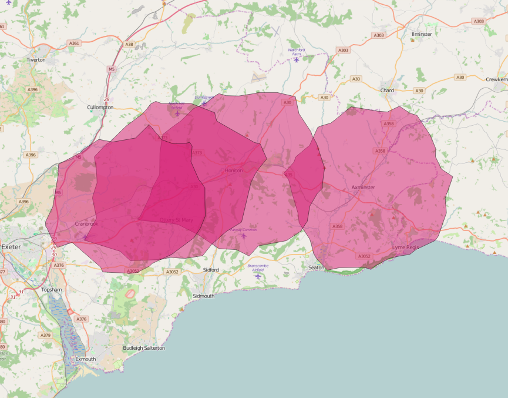
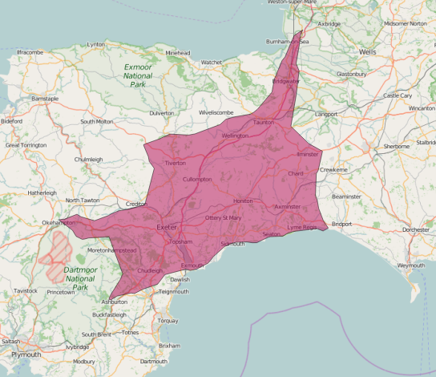

# Using R, PostgreSQL and pgRouting to automatically generate drive time or drive distance based network buffers
This R Script will automatically generate drive distance or drive time based buffers for a given set of starting nodes, using the pgRouting functions: pgr_drivingDistance and pgr_pointsAsPolygon. The polygons are written to a PostgreSQL table. It requires suitably prepared database tables derived from the Ordnance Survey Open Roads dataset, but could be modified to use any other suitably prepared routable network.

## Assumptions

The script assumes the following:

* You have a spatially enabled PostgreSQL database called 'spatial' which has the postgis and pgrouting extensions installed
* You have a table called 'roadlink' in a schema called 'openroads' which has been prepared following the guidelines here and tested: https://github.com/marcusyoung/pgRouting/tree/master/openroads

The script has been tested using pgRouting 2.0.0

## Preparations

In addition to the prerequisites above, the 'roadnode' shapefile that is part of the OS Open Maps dataset needs to be imported into PostgreSQL. Import this into your 'openroads' schema. This can be done using the PostGIS Shapefile and DBF Loader 2.1 within pgAdmin III, using the following settings:
- encoding set to LATIN1
- set to generate simple geometries
- SRID set to 27700

**NOTE: It is necessary to amend the identifier column of the 'roadnode' table, to remove the leading 'L' and convert it from character to integer. The following SQL code should achieve this:**

```sql
UPDATE openroads.roadnode set identifier = replace(identifier, 'L', '');
ALTER TABLE openroads.roadnode ALTER COLUMN identifier  TYPE integer USING (identifier::integer);
```
  

## The script
The file [create_drivetime_polygons.R](create_drivetime_polygons.R) contains all the code needed to automatically generate either distance or time based network buffer polygons. The included comments should be self-explanatory. In brief, the script does the following:

* Creates a table in the database to store the generated polygons (drivetime_polygons)
* Defines a vector containing a list of starting nodes. Each node will be the nearest suitable node to a site or facility that you want to generate drive time buffers for. You can identify these by displaying the 'roadnode' table in QGIS
* Defines parameters for the pgr_drivingDistance function (you can specify whether you want distance or time based buffers and set the limit)
* Loops through the list of startnodes, and for each one:
  * creates a temporary database table called nodes to hold the relevant nodes identified by pgr_drivingDistance 
  * checks that the temp table has at least 3 rows (pgr_pointsAsPolygon requires at least three points) and if so:
    * generates a polygon using the pgr_pointsAsPolygon and inserts it into the drivetime_polygons table
  * Drops the temp table before moving on to the next starting node.
* A windows progress bar is included as some of the queries may take a while. The progress is updated after each starting node has been processed.
  
## Example of drive distance buffers

The buffer polygons can be displayed in QGIS direct from PostgreSQL. Set a filter to show only certain polygons.

These are 10km drive distance network buffers for Axminster, Honiton, Feniton and Whimple railway stations.



## Example of drive distance buffer

This is a 25 minutes drive time buffer for Honiton railway station. Based on this, the average speeds used when preparing the roadlinks table need some tweaking!



Have fun!