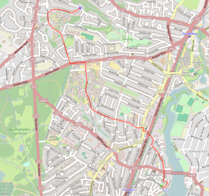

### Using pgRouting with the OS Open Roads dataset

The Ordnance Survey has recently released a new open data roads layer, called "Open Roads". It is currently still described as a beta product but is available for download. It is higher resolution than Meridian2 (approx scale 1:25,000) and has a network topology and is pretty much routable "out of the box".

## Advantages over Meridian2 and Strategi
There is greater detail in urban areas with more streets represented. This may be useful for urban accessibility studies, giving more accurate road distance measures. 

## Disadvantages over Meridian2 and Strategi
- It is a very large dataset, with some 3.2 million records, and therefore more difficult to work with - the main problems being query speed. It is possible to download smaller portions of the dataset (25km<sup>2</sup> areas), but only in GML format.
- It has a basic road classification scheme: Motorways, A-roads, B-roads, Unclassified and Not Classified. The final version will include Classified Unnumbered roads which are known unofficially as C-roads. There is a 'formofway' column which identifies the physical form of the road: single carriageway, dual carriageway, roundabout and slip road. The lack of distinction between different types of unclassified road makes the dataset less than ideal for drive time analysis, despite OS stating that it is suitable for "simple drive time analysis". More details are available in the OS guide to the dataset: https://www.ordnancesurvey.co.uk/docs/user-guides/os-open-roads-user-guide.pdf

## Preparing the database for pgRouting
The Open Maps dataset can be downloaded from:

http://www.ordnancesurvey.co.uk/opendatadownload/products.html

The download contains three shapefiles: road nodes; motorway nodes; and road links. Only the road links shapefile is needed to use with pgRouting. 

I imported the shapefile into a new PostgreSQL schema (called openroads) using the PostGIS Shapefile and DBF Loader 2.1 within pgAdmin III, using the following settings:
- encoding set to LATIN1
- set to generate simple geometries
- SRID set to 27700

The file [pgrouting-openroads.sql](pgrouting-openroads.sql) contains all the queries needed to prepare the database for using with pgRouting. The included comments should be self explanatory. Note that the data provided by OS already contains the start and end nodes of each road link, and there is no need to generate the topology using pgRouting. However, it is necessary to convert these columns from varchar to integer. 

Note that running the complete script will take a considerable length of time, maybe one or two hours.

## Run a query to test it - here's an example (a trip in Southampton)

```sql
SELECT seq, id1 AS node, id2 AS edge, cost FROM pgr_dijkstra('
                SELECT gid AS id,
                   source::integer,
                   target::integer,
				   cost_time::double precision AS cost
                   FROM openroads.roadlink',
                   5786852, 6815911, false, false);
```



Thanks to [mixedbredie](https://github.com/mixedbredie) for prior work on using pgRouting with Strategi and Meridian2 datasets.