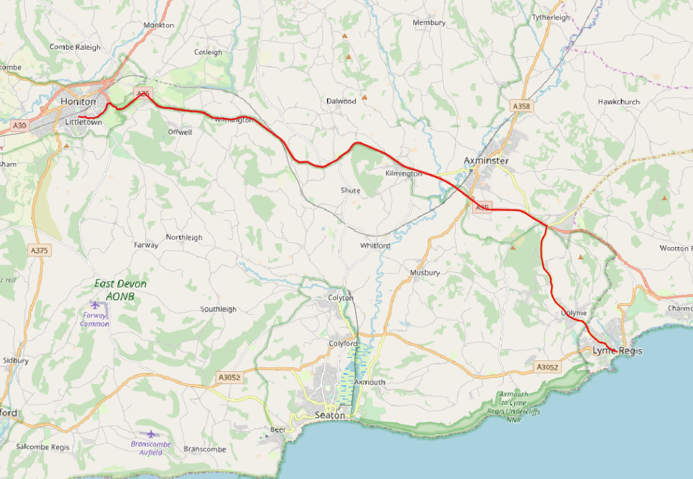

*Now updated to work with latest version of Open Roads.*

## A script to prepare the OS Open Roads dataset for use with pgRouting

The Ordnance Survey provides an open data roads layer for GB, called "Open Roads". It is higher resolution than the old Meridian2 product (now withdrawn) and has an approximate  scale of 1:25,000. Unlike Meridian2 (and Strategi) it has a network topology that is pretty much routable "out of the box". **There is no need to use the `pgr_createTopology()` function with this dataset.**

### Advantages over Meridian2 and Strategi
There is greater detail in urban areas with more streets represented. This may be useful for urban accessibility studies, giving more accurate road distance or time measures. 

### Disadvantages over Meridian2 and Strategi
- It is a very large dataset, with more than 3.5 million links, and is therefore more difficult to work with - the main problem being query speed (although this can be improved by limiting the dataset to a particular area of GB if that meets your needs). It is supplied in a number of shapefiles each of which covers an area of 100 by 100 km. It is also available in GML format.
- It has a fairly basic road classification scheme (road function): motorways, A-roads, B-roads, minor roads, local roads, local access roads, restricted local access roads and secondary access roads. There is a 'formofway' field which identifies the physical form of the road, for example: single carriageway, dual carriageway, roundabout and slip road. More details are available in the OS guide to the dataset: https://www.ordnancesurvey.co.uk/business-and-government/products/os-open-roads.html

### Preparing the database for pgRouting
The Open Roads dataset can be downloaded from:

http://www.ordnancesurvey.co.uk/opendatadownload/products.html

The download contains multiple shapefiles for each of the 100 by 100 km squares, with separate shapefiles for roadnodes, motorway junctions (a point feature of the generalised location of the junctions and not needed for pgRouting) , and roadlinks. Only the roadlinks are strictly necessary to use open roads with pgRouting, but in the SQL script roadnodes is also used to generate new ids for the start and end nodes (as pgrouting requires these to be integers).

I merged the separate shapefiles for roadnodes and roadlinks using QGIS v3.4.1 and used the DB Manager to import these into new PostgreSQL tables, using the following settings:
- set to generate single-part geometries
- SRID set to 27700

The file [pgrouting-openroads.sql](pgrouting-openroads.sql) contains all the queries needed to prepare the database for using with pgRouting. The included comments should be self explanatory. Note that the data provided by OS already contains the start and end nodes of each road link, and there is no need to generate the topology using pgRouting. 

Note that running the complete script may take some time (30 minutes on my workstation with a local PostgreSQL server).

### Run a query to test it - here's an example (a trip in Devon from Honiton to Lyme Regis)

```sql
SELECT X.* FROM pgr_dijkstra('
                SELECT id, source, target, cost_time AS cost FROM openroads.roadlinks',
                1163580,
		743292,
		false
		) AS X
		ORDER BY seq;
```



Thanks to [mixedbredie](https://github.com/mixedbredie) for prior work on using pgRouting with Strategi and Meridian2 datasets.
