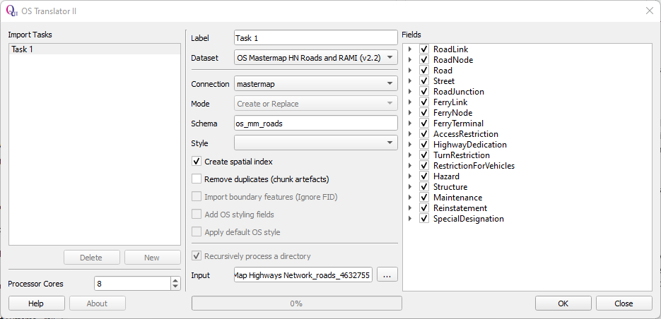
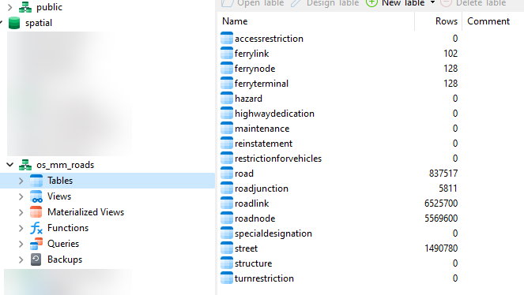
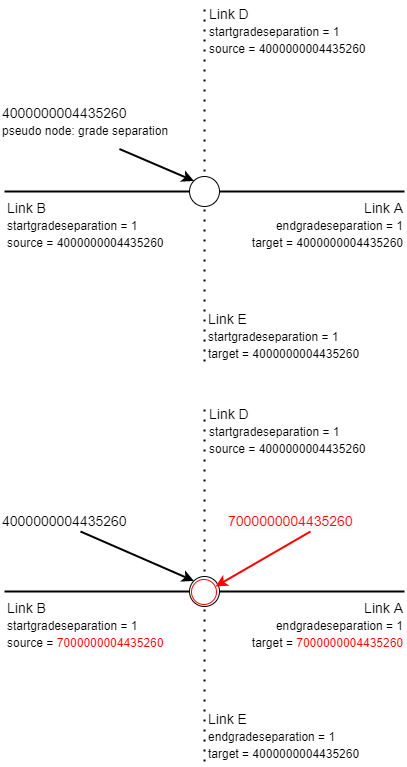
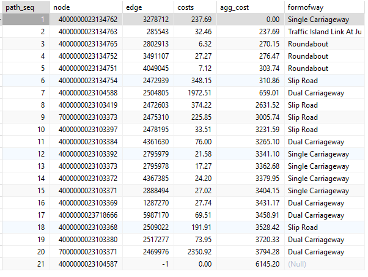
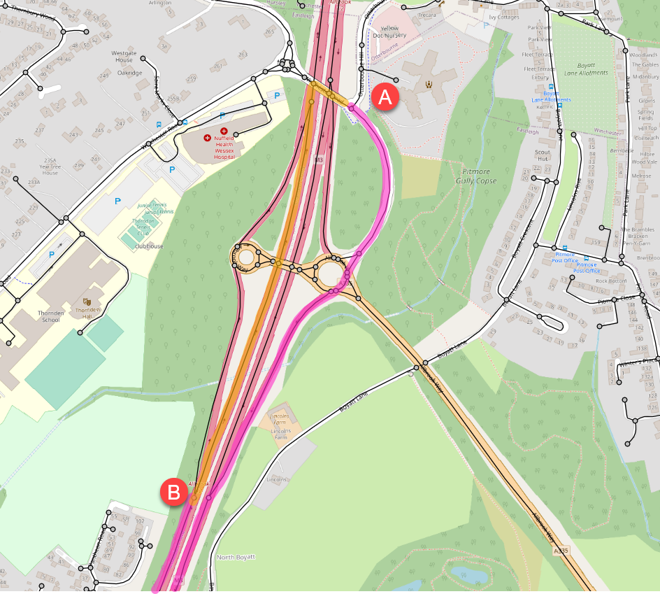

# Using OS MasterMap Highways Network (Roads) with pgRouting - the easy way

There are several methods to do this that have been shared on the Internet but in my view they over-complicate a problem that is actually relatively easy to solve with a few SQL queries. There are two key problems that we need to solve:

1. The MM roadlinks dataset is not topological correct as nodes occur where roads cross above or underneath one another.  The information to identify where this occurs is provided and we need to use this to modify the dataset so that it is suitable for pgRouting (which does not understand the concept of Grade Separation).
2. We need to ensure that pgRouting correctly deals with one-way roads.

I am assuming that you already have PostgreSQL, PostGIS and pgRouting installed and have created a spatial database.

## Step 1 - get the data

1. Download the data, e.g from Edina DigiMap. You will need to download ‘Highways - Roads’  which is available in GML3 format for the whole of GB. In this example I am not using the Routing and Asset Management Information (RAMI) extension to the product.
2. Extract the data from the supplied ZIP file to a suitable location. 

## Step 2 - import data into a PostgreSQL database via QGIS

1. Install the OS Translator II QGIS plugin from Lutra Consulting (https://www.lutraconsulting.co.uk/projects/ostranslator-ii/)

2. In your spatial database create a schema: `os_mm_roads` 

3. Launch the OS Translator II plugin and set the following:

   - Dataset:  ‘OS Mastermap HN Roads and RAMI (v2.2)’
   - Connection: A PostgreSQL connection to your database that you have already set up in QGIS
   - Schema: ‘os_mm_roads’
   - Create spatial index: check the box
   - Input: the location of the folder containing the roads data that you extracted from the zip file in Step 1.
   - Fields: leave with all selected which is the default

   

4. Now click on OK and wait for the import of the Roads data to complete. How long this takes will depend on the specification of your computer (with 8 processor cores it took 434 seconds on my computer).

   

## Step 3 - generate pgRouting compatible source and target fields

We need to convert the alphanumeric node references in the road link table to integers.

```sql
-- create new columns for source and target
alter table os_mm_roads.roadlink
add column source int8,
add column target int8; 

-- trim off leading characters of node references and populate new columns
update os_mm_roads.roadlink
set source = ltrim(startnodehref, '#osgb')::int8,
target = ltrim(endnodehref, '#osgb')::int8;
```

## Step 4 - deal with grade separation to ensure network is topologically correct

When there is grade separation at a node in the roadnode table, the field `formofroadnodetitle` has the value  ‘pseudo node’ and the field `classification` has the value 'Grade Separation'. We first create an alternative UID for these nodes and place them into a new lookup table. Then, for every roadlink  where the field `startgradeseparation`  and/or `endgradeseparation` has the value ‘1’, we update the roadlink table and change the target and/or source node to the alternative UID as applicable. Effectively this duplicates the impacted node. Where a road crosses another road the relevant node UIDs of the component links are changed while they remain unchanged for the links underneath. 

The principle is illustrated in the diagrams below, where the road comprising of links A and B crosses above the road comprising of links D and E. In the top diagram, representing the native roadlink data structure, pgRouting would consider there to be a road junction at node 4000000004435260. However, we know from the grade separation information that this would be incorrect. In the bottom diagram this has been corrected by altering the target node UID of Link A and the source node UID of Link B to 7000000004435260. There is now no valid route between the upper and lower road. 



The SQL code to implement this change is shown below.

```sql
-- node id is localid (change from charvar to bigint).
alter table os_mm_roads.roadnode
alter column localid type int8 using localid::int8;

-- create lookup table of the pseudo grade separation nodes with newid
create table os_mm_roads.pseudo_nodes_gs as
select localid, (localid + 3000000000000000) AS newid from os_mm_roads.roadnode where formofroadnodetitle = 'pseudo node' and classification = 'Grade Separation';

-- update roadlink table
update os_mm_roads.roadlink a
set source = b.newid
from os_mm_roads.pseudo_nodes_gs b
where a.startgradeseparation = 1 and a.source = b.localid;

update os_mm_roads.roadlink a
set target = b.newid
from os_mm_roads.pseudo_nodes_gs b
where a.endgradeseparation = 1 and a.target = b.localid;
```

 ## Step 5 Dealing with one-way roads

To route correctly using pgRouting when one-way roads are present, we must specify to use a directed graph in the relevant function, such as `pgr_dijkstra()`, and have a column for both cost and reverse_cost. We set either cost or reverse_cost to an extremely high value (e.g. 1000000) to prevent routing the wrong way along an edge. The MM roadlinks table has a field called `directionalitytitle` which indicates whether the link is two-way ('both directions') or can only be traversed in the direction of the line (from source to target - ‘in direction’)  or can only be traversed in the opposite direction of the line (from target to source - 'in opposite direction'). The SQL code below creates the cost columns and then sets the cost and reverse_cost values.

```sql
-- prepare for directed
-- based on field directionalitytitle with the possible values:
-- 'both directions'
-- 'in direction'
-- 'in opposite direction'

alter table os_mm_roads.roadlink
add column cost real,
add column reverse_cost real;

update os_mm_roads.roadlink
set cost = length
where directionalitytitle in ('both directions', 'in direction');

update os_mm_roads.roadlink
set cost = 1000000
where directionalitytitle = 'in opposite direction';

update os_mm_roads.roadlink
set reverse_cost = length
where directionalitytitle in ('both directions', 'in opposite direction');

update os_mm_roads.roadlink
set reverse_cost= 1000000
where directionalitytitle = 'in direction';
```

## Step 6 - test our work with a query

```sql
SELECT
	X.*,
	A.formofway,
	A.name 
FROM
	pgr_dijkstra('SELECT ogc_fid as id, source, target, cost, reverse_cost FROM os_mm_roads.roadlink', 4000000023134762, 4000000023104587, directed => true) as X
	LEFT JOIN (select ogc_fid, formofway, roadname as name from os_mm_roads.roadlink) AS A ON A.ogc_fid = X.edge 
ORDER BY
	seq;
	
```

The returned route from A to B is shown in the table and map below. 



The most direct route using the unprocessed MM roadlinks table is shown in orange. This would involve joining the motorway at a pseudo node with grade separation and travelling the wrong way down the west carriageway. The suggested route using the amended MM roadlinks table is shown in purple (with the route down to the next motorway junction clipped out for clarity). The grade separation and one-way roads are now fully respected. 



<small>Base map &copy; OpenStreetMap contributors</small>

